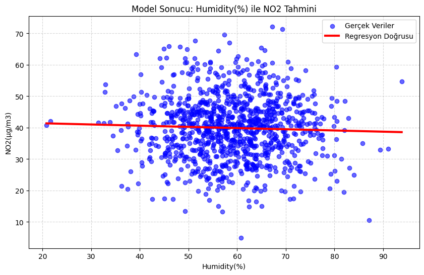

# 🌍 Hava Kalitesi Tahmin Projesi (Air Quality Prediction)

Bu proje, Avrupa'daki hava kalitesi verilerini kullanarak, meteorolojik faktörlerin (Nem, Sıcaklık vb.) **NO2 (Azot Dioksit)** kirliliği üzerindeki etkisini analiz etmek ve tahminlemek amacıyla geliştirilmiştir.

## 📂 Veri Seti (Dataset)
Projede kullanılan veri seti Kaggle platformundan alınmıştır.
- **Link:** [Air Quality Europe Dataset](https://www.kaggle.com/datasets/luckskywalker315/air-quality-europe-dataset)
- **Hedef Değişken:** `NO2(µg/m3)` (Havadaki Azot Dioksit miktarı)

---

## 🛠️ Kullanılan Teknolojiler ve Kütüphaneler

Proje **Python** dili ile geliştirilmiş olup, aşağıdaki kütüphaneler kullanılmıştır:

* **Pandas:** Veri okuma ve manipülasyonu (CSV işlemleri).
* **Numpy:** Sayısal işlemler.
* **Matplotlib & Seaborn:** Veri görselleştirme (Grafikler ve Isı Haritası).
* **Scikit-learn:** Makine öğrenmesi modelinin kurulması ve eğitilmesi.

---

## 🚀 Proje Aşamaları

Proje geliştirilirken aşağıdaki adımlar izlenmiştir:

### 1. Veri Ön İşleme (Data Preprocessing)
* Veri seti yüklendi ve yapısal incelemesi yapıldı.
* **Veri Sızıntısını (Data Leakage) Önleme:** Hedef değişken olan NO2'nin cevabını barındıran `AQI` (Hava Kalite İndeksi) sütunları veri setinden çıkarıldı. Böylece modelin kopya çekmesi engellendi.
* Eksik veriler (NaN) temizlendi.

### 2. Keşifçi Veri Analizi (EDA)
* Değişkenler arasındaki ilişkileri görmek için **Korelasyon Matrisi (Heatmap)** çizdirildi.
* **Bulgu:** Nem (Humidity) ile NO2 arasında çok düşük bir ilişki (0.01) olduğu gözlemlendi.

### 3. Model Seçimi ve Eğitimi
* **Model:** `Linear Regression` (Doğrusal Regresyon)
* **Neden Bu Model?**
    * Elimizdeki problem bir **Regresyon** problemidir (Sayısal bir değer tahmin ediyoruz).
    * Veriler arasındaki ilişkiyi anlamak için en temel ve açıklanabilir (baseline) model olduğu için tercih edilmiştir.

### 4. Modelin Görselleştirilmesi
* Seçilen en baskın özellik (Humidity) ile NO2 arasındaki ilişki görselleştirildi.
* Modelin çizdiği regresyon doğrusu (Kırmızı Çizgi) grafik üzerine eklendi.

---

## 📊 Sonuçlar ve Değerlendirme

Modelin test verisi üzerindeki performansı aşağıdaki gibidir:

* **Ortalama Kare Hata (MSE):** 101
* **R2 Skoru:** ~0.00

**Yorum:**
Yapılan analizler sonucunda, bu veri setinde **Nem (Humidity)** oranının hava kirliliğini tahmin etmekte tek başına yeterli olmadığı bilimsel olarak kanıtlanmıştır. Veriler arasında doğrusal bir ilişki bulunmadığı için model, risk almayarak **"Ortalama Değer Tahmini"** yapma eğilimi göstermiştir.

---
