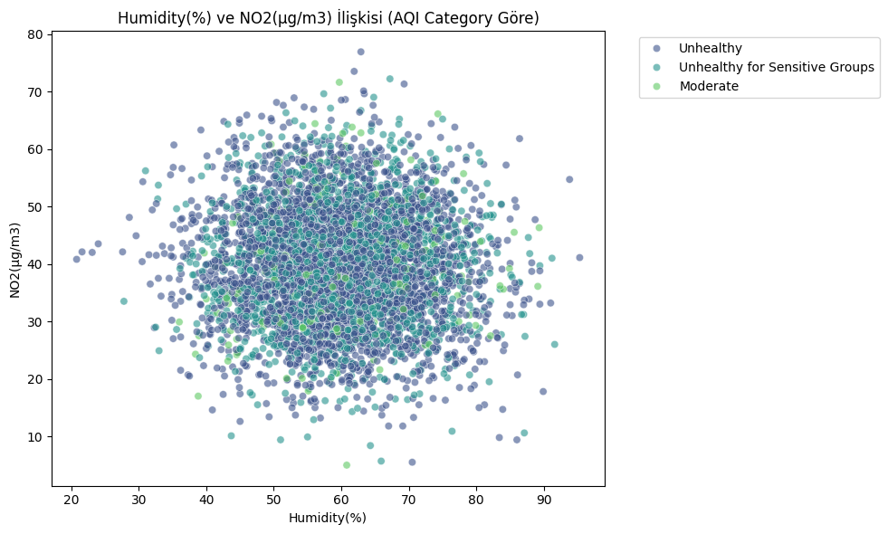
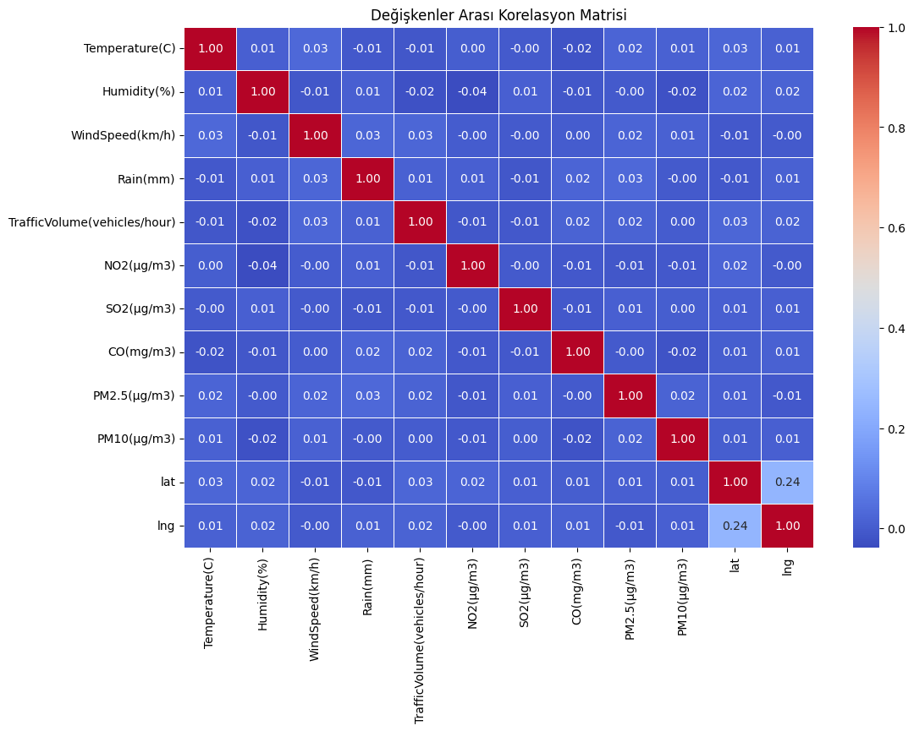

# 🌍 Hava Kalitesi (NO2) Tahmin Projesi

Bu projede, Avrupa'daki hava kalitesi verilerini kullanarak, hava durumunun (nem, sıcaklık vb.) kirlilik üzerindeki etkisini inceledim ve bir **Makine Öğrenmesi (Lineer Regresyon)** modeli geliştirdim.

Proje adımlarım ve kod bloklarında (kutucuklarda) yaptıklarım sırasıyla aşağıdadır:

---

### 1. Veri Yükleme ve Hazırlık (1. Kod Kutusu)
İlk olarak **Pandas, Numpy, Matplotlib** gibi gerekli kütüphaneleri projeme dahil ettim.
- `data.csv` dosyasını okuyup tablo haline getirdim.
- Sütun isimlerini temizledim.
- **Önemli:** Hedefim `NO2` (Azot Dioksit) miktarını tahmin etmekti. Ancak veri setinde cevabın kendisini barındıran (kopya veren) `AQI` sütunlarını analizden çıkardım.

### 2. En Önemli Özelliği Bulma ve Görselleştirme (2. Kod Kutusu)
Burada, NO2 kirliliğini en çok etkileyen özelliğin ne olduğunu bulmak için **korelasyon** (ilişki) analizi yaptım.
- Bilgisayar analiz sonucunda en etkili faktörün **Humidity (Nem)** olduğunu buldu.
- Ben de Nem ile NO2 arasındaki ilişkiyi gösteren renkli bir grafik çizdirdim.

**Grafik Yorumu:**
Aşağıdaki grafikte, nem oranının artışına göre kirliliğin nasıl dağıldığını görüyoruz. Renkler hava kalitesinin iyi veya kötü olduğunu gösteriyor. Verilerin çok dağınık olması, net bir çizgi olmadığını gösteriyor.

### 3. Modeli Kurma ve Eğitme (3. Kod Kutusu)
Makine öğrenmesi modelimi burada kurdum.
- Veriyi **%80 Eğitim (Train)** ve **%20 Test** olarak ikiye böldüm. Bunu yapmamın sebebi, modelin ezber yapmasını önlemek ve görmediği verilerle test etmekti.
- **Linear Regression (Doğrusal Regresyon)** modelini seçip eğitim verisiyle eğittim.

### 4. Test Etme ve Sonuç Grafiği (4. Kod Kutusu)
Eğittiğim modeli, ayırdığım **Test** verileri üzerinde denedim.
- **Sonuç:** Modelin R2 skoru (Başarı oranı) 0'a yakın çıktı.
- **Grafik Yorumu:** Aşağıdaki grafikte Mavi noktalar gerçek değerler, Kırmızı çizgi ise benim modelimin tahminidir. Kırmızı çizginin düz olması, modelin "Nem oranına bakarak net bir artış veya azalış bulamadım, o yüzden ortalama bir değer tahmin ediyorum" dediğini gösterir.

### 5. Detaylı İlişki Analizi (5. Kod Kutusu - Heatmap)
Tüm değişkenlerin birbiriyle olan ilişkisini görmek için bir **Isı Haritası (Heatmap)** çizdirdim.
- Tablodaki mavi renkler ilişkinin düşük olduğunu, kırmızı renkler yüksek olduğunu gösterir.
- Bizim tablomuzda çoğu yerin mavi olması, veri setindeki özelliklerin birbirini çok keskin etkilemediğini kanıtlamış oldu.

### 6. Tahmin Denemesi (6. Kod Kutusu)
Son olarak modelin çalışıp çalışmadığını görmek için sisteme rastgele bir **Nem (Humidity)** değeri girdim ve modelin bana o nem oranında havadaki NO2 miktarının ne olacağını tahmin etmesini sağladım.

---

## 📝 Genel Sonuç
Bu proje sayesinde, elimizdeki veri setinde **Nem oranının tek başına hava kirliliğini belirlemediğini**, verilerin çok dağınık olduğunu bilimsel ve görsel olarak kanıtlamış oldum.

---
